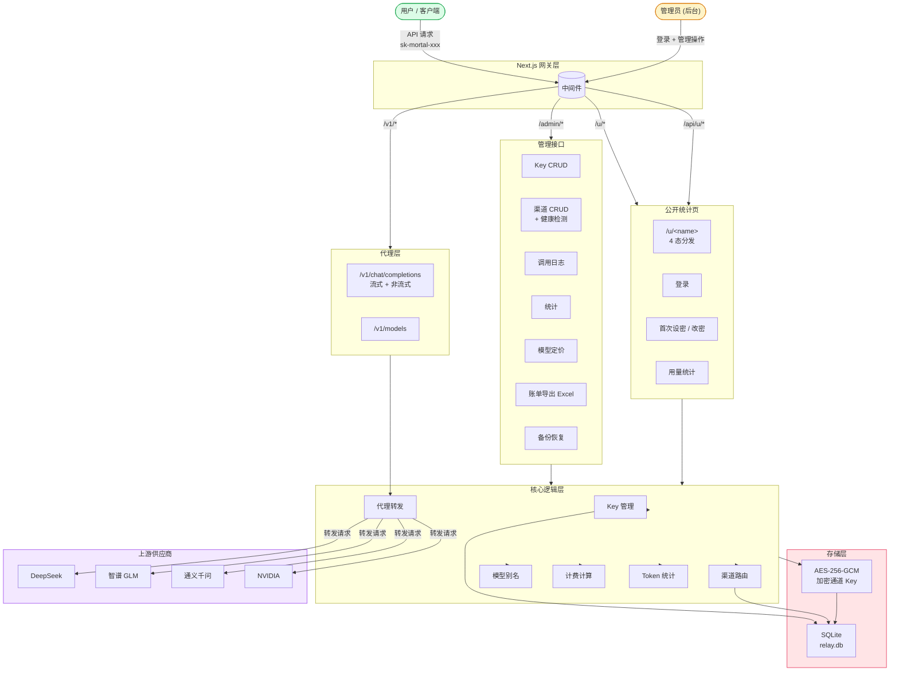
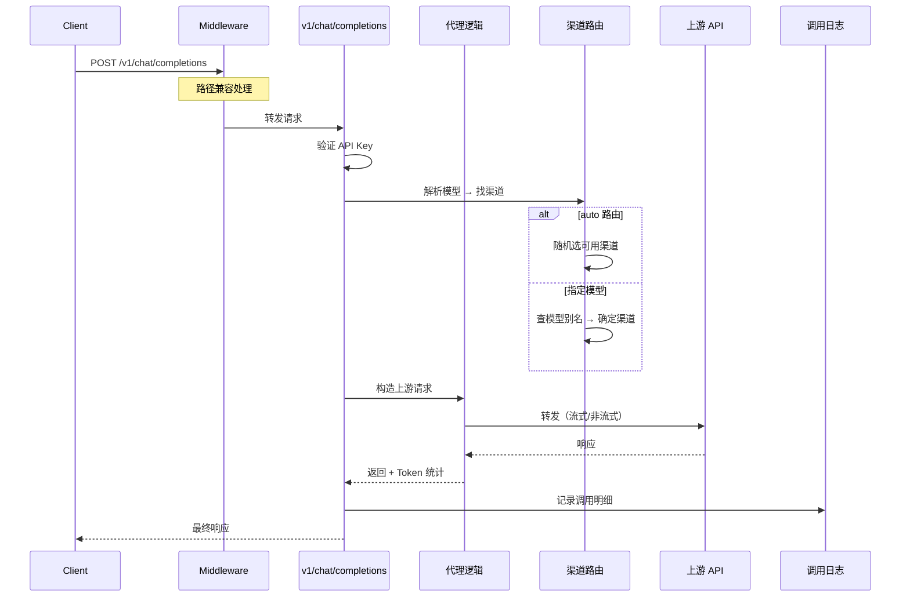

# Mortal API

> AI 大模型 API 中转站 — 兼容 OpenAI API 格式，支持多模型路由、Key 管理、渠道管理、调用统计、账单导出

**GitHub**: [https://github.com/super-mortal/mortal-api](https://github.com/super-mortal/mortal-api)

---

## 系统架构



## 请求流程



---

## 技术栈

| 技术 | 用途 |
|------|------|
| **Next.js 16** (App Router) | 全栈框架 |
| **TypeScript** | 类型安全 |
| **Tailwind CSS v4** | 样式 |
| **SQLite** (better-sqlite3) | 数据库（零配置） |
| **Recharts** | 统计图表 |
| **Lucide Icons** | 图标（本地加载，无 CDN） |
| **JWT** (jsonwebtoken) | 认证 |
| **AES-256-GCM** (Node.js crypto) | API Key 加密存储 |
| **ExcelJS** | 账单导出 |
| **@dnd-kit** | 拖拽排序 |
| **react-day-picker** | 日期选择器 |

## 功能特性

### 代理能力
- **OpenAI 兼容** — 完全兼容 OpenAI Chat Completions API，支持流式/非流式
- **多模型路由** — 支持 `auto` 自动路由、指定模型、模型别名映射
- **路径兼容** — 自动处理 `/api/v1/...`、`/v1/v1/...`、裸 `/chat/completions` 等误配置

### 管理后台
- **Dashboard 仪表盘** — Key / 渠道 / 调用数总览 + 趋势 / Token / 模型分布图表
- **Key 管理** — 创建/编辑/删除 API Key，设置额度、过期、渠道/模型权限，支持拖拽排序
- **渠道管理** — 管理上游供应商（DeepSeek、智谱 GLM、通义千问、NVIDIA 等），支持一键健康检测 + 冷却机制
- **模型广场** — 查看所有可用模型及别名映射，配置模型定价（输入/输出/缓存价格）
- **调用日志** — 按时间/状态/Key/模型筛选，支持单条和日期范围批量删除
- **账单导出** — 按 Key / 日期范围导出 Excel 账单，支持明细/每日汇总/模型汇总
- **备份恢复** — 一键导出/导入全部数据（JSON 格式）

### 公开统计页
- 访问密码认证 + 30 天 session 免登录
- 用量总览: 总调用数、总费用、缓存/未缓存输入 Token、输出 Token、总 Tokens
- 调用趋势图: 今天 / 7 天 / 30 天筛选
- 近期调用明细（最近 50 条）
- 管理员可远程重置访问密码（强制改密流程）

### 安全特性
- 上游 API Key 使用 AES-256-GCM 加密存入数据库
- 管理员 JWT 认证 + 后台中间件保护
- API Key 访问密码 + session 机制
- Rate limiting（内存限流）
- 渠道健康检测 + 自动冷却

---

## 快速开始

### 环境要求

- Node.js 18+
- npm 9+

### 安装

```bash
git clone https://github.com/super-mortal/mortal-api.git
cd mortal-api

# 安装依赖
npm install

# 配置环境变量
cp .env.example .env
# 编辑 .env 文件，修改以下配置
```

### 配置

编辑 `.env` 文件：

| 变量 | 说明 | 默认值 |
|------|------|--------|
| `ADMIN_PASSWORD` | 管理后台登录密码 | `admin123` |
| `JWT_SECRET` | JWT 签名密钥（必须修改！用于加密 API Key） | — |
| `DATABASE_PATH` | SQLite 数据库路径 | `data/relay.db` |

> **⚠️ 安全提醒**：上线前务必修改 `ADMIN_PASSWORD` 和 `JWT_SECRET`！
>
> `JWT_SECRET` 一旦设定并创建了渠道后请勿修改，否则已加密的 API Key 将无法解密。

### 启动

```bash
# 开发模式
npm run dev

# 生产构建并启动
npm run build
npm start
```

访问 [http://localhost:3000](http://localhost:3000)

> 首次启动会自动创建数据库并播种 5 个默认渠道（DeepSeek V4 Pro/Flash、GLM-5/5.2、Qwen-Plus）。
> 管理后台地址: `http://localhost:3000/login`

---

## 全新服务器部署指南

### 1. 安装依赖

```bash
# Ubuntu / Debian
curl -fsSL https://deb.nodesource.com/setup_20.x | sudo -E bash -
sudo apt install -y nodejs git

# 验证
node -v
npm -v
```

### 2. 克隆项目

```bash
git clone https://github.com/super-mortal/mortal-api.git
cd mortal-api
npm install
```

### 3. 配置环境变量

```bash
cp .env.example .env
nano .env
```

确保修改以下字段：

```
ADMIN_PASSWORD=你的强密码
JWT_SECRET=你的随机密钥字符串（至少32位）
```

### 4. 构建并启动

```bash
# 构建
npm run build

# 使用 PM2 守护进程（推荐）
npm install -g pm2
pm2 start npm --name mortal-api -- start
pm2 save
pm2 startup

# 或直接后台启动
nohup npm start > app.log 2>&1 &
```

### 5. 配置反向代理（Nginx）

```nginx
server {
    listen 80;
    server_name your-domain.com;

    location / {
        proxy_pass http://127.0.0.1:3000;
        proxy_http_version 1.1;
        proxy_set_header Upgrade $http_upgrade;
        proxy_set_header Connection 'upgrade';
        proxy_set_header Host $host;
        proxy_set_header X-Real-IP $remote_addr;
        proxy_set_header X-Forwarded-For $proxy_add_x_forwarded_for;
        proxy_read_timeout 86400s;
    }
}
```

> 流式响应（SSE）需要较长的 `proxy_read_timeout`

启用 HTTPS（推荐使用 Let's Encrypt）：

```bash
sudo apt install -y certbot python3-certbot-nginx
sudo certbot --nginx -d your-domain.com
```

### 6. 防火墙

```bash
sudo ufw allow 80/tcp
sudo ufw allow 443/tcp
sudo ufw allow 22/tcp
sudo ufw enable
```

---

## API 使用

### 基础 URL

```
https://你的域名/v1
```

### 使用者查看页面

Key 使用者可访问自己的使用统计页:

```
GET https://your.domain.com/u/<key-name>
```

- **首次访问**: 设置访问密码（≥12 位，含大小写字母与特殊字符）
- **后续访问**: 用密码登录，自动延续 30 天 session
- **管理员重置后**: 登录页变为"设置新密码"页（输入当前默认值 + 新密码 + 确认），提交后直接进入统计页
- **忘记密码**: 联系管理员在管理后台 → Key 管理 → 重置访问密码

统计页展示:
- 总调用次数 / 总费用
- 缓存输入 / 未缓存输入 / 输出 / 总 Tokens
- 调用趋势图（今天/7天/30天筛选）
- 近期调用明细（最近 50 条，含模型/Token/费用/状态）

### 聊天补全

```bash
curl https://你的域名/v1/chat/completions \
  -H "Content-Type: application/json" \
  -H "Authorization: Bearer sk-mortal-xxx" \
  -d '{
    "model": "auto",
    "messages": [{"role": "user", "content": "你好"}],
    "stream": true
  }'
```

### 模型列表

```bash
curl https://你的域名/v1/models \
  -H "Authorization: Bearer sk-mortal-xxx"
```

### 支持的模型参数

| 参数 | 类型 | 说明 |
|------|------|------|
| `model` | string | 模型名（`auto` 自动路由，或指定模型/别名） |
| `messages` | array | 对话消息 |
| `stream` | boolean | 是否流式输出 |
| `temperature` | number | 采样温度 |
| `top_p` | number | 核采样 |
| `max_tokens` | number | 最大输出 Token |
| `stop` | string[] | 停止词 |
| `tools` | array | 工具调用 |
| `response_format` | object | 响应格式 |

### 管理后台 API

所有管理接口需要 `Authorization: Bearer <admin_token>` 头。

#### 认证

| 方法 | 路径 | 说明 |
|------|------|------|
| `POST` | `/admin/login` | 管理员登录（Body: `{ password }`） |

#### Key 管理

| 方法 | 路径 | 说明 |
|------|------|------|
| `GET` | `/admin/keys` | 获取所有 Key（含访问密码状态） |
| `POST` | `/admin/keys` | 创建 Key |
| `PATCH` | `/admin/keys` | 更新 Key（含重置访问密码） |
| `DELETE` | `/admin/keys?id=xxx` | 删除 Key |

#### 渠道管理

| 方法 | 路径 | 说明 |
|------|------|------|
| `GET` | `/admin/channels` | 获取所有渠道（含模型列表） |
| `POST` | `/admin/channels` | 创建渠道 |
| `PATCH` | `/admin/channels` | 更新渠道 |
| `PUT` | `/admin/channels` | 全渠道健康检测 |
| `DELETE` | `/admin/channels?id=xxx` | 删除渠道 |

#### 日志 / 统计

| 方法 | 路径 | 说明 |
|------|------|------|
| `GET` | `/admin/logs` | 查询日志（支持 `page`、`pageSize`、`status`、`relay_key_id`、`model`、`start_date`、`end_date`） |
| `DELETE` | `/admin/logs` | 删除日志（`?id=xxx` 单条 或 `?start_date=&end_date=` 批量） |
| `GET` | `/admin/stats` | 统计数据（支持 `period=1d\|7d\|30d`） |

#### 定价 / 账单 / 备份

| 方法 | 路径 | 说明 |
|------|------|------|
| `GET` | `/admin/pricing` | 获取所有模型定价 |
| `POST` | `/admin/pricing` | 更新模型定价（`{ model_id, prompt_price, completion_price, cached_prompt_price }`） |
| `POST` | `/admin/billing` | 导出账单 Excel（支持按 Key/日期/汇总方式筛选） |
| `GET` | `/admin/backup` | 导出 JSON 格式全量备份 |
| `POST` | `/admin/backup` | 导入 JSON 备份恢复 |

---

## 目录结构

```
mortal-api/
├── src/
│   ├── app/
│   │   ├── api/
│   │   │   └── u/[name]/              # 公开统计 API
│   │   │       ├── setup/route.ts     # 设密 / 改密
│   │   │       ├── login/route.ts     # 密码登录
│   │   │       └── logout/route.ts    # 登出
│   │   ├── v1/
│   │   │   ├── chat/completions/      # OpenAI 兼容代理
│   │   │   └── models/                # 模型列表
│   │   ├── admin/                     # 管理 API
│   │   │   ├── login/                 # 管理员登录
│   │   │   ├── keys/                  # Key CRUD
│   │   │   ├── channels/              # 渠道 CRUD
│   │   │   ├── logs/                  # 日志（含批量删除）
│   │   │   ├── stats/                 # 统计
│   │   │   ├── pricing/               # 模型定价
│   │   │   ├── billing/               # 账单导出
│   │   │   └── backup/                # 备份恢复
│   │   ├── u/[name]/                  # 公开统计页
│   │   │   ├── page.tsx               # 4 态分发
│   │   │   ├── stats-view.tsx         # 用量统计视图
│   │   │   ├── trend-chart.tsx        # 调用趋势图
│   │   │   ├── setup-form.tsx         # 首次设密
│   │   │   ├── login-form.tsx         # 密码登录
│   │   │   ├── change-password-form.tsx # 强制改密
│   │   │   └── logout-button.tsx      # 登出按钮
│   │   ├── dashboard/                 # 管理后台页面
│   │   │   ├── layout.tsx             # 后台布局（抽屉导航）
│   │   │   ├── page.tsx               # 仪表盘
│   │   │   ├── keys/                  # Key 管理
│   │   │   ├── channels/              # 渠道管理
│   │   │   ├── models/                # 模型广场
│   │   │   ├── logs/                  # 调用日志
│   │   │   ├── billing/               # 账单导出
│   │   │   └── backup/                # 备份恢复
│   │   ├── login/                     # 登录页
│   │   └── page.tsx                   # 首页
│   ├── lib/                           # 核心逻辑
│   │   ├── db.ts                      # SQLite + 迁移
│   │   ├── types.ts                   # 类型定义
│   │   ├── keys.ts                    # Key 管理
│   │   ├── channels.ts                # 渠道路由
│   │   ├── proxy.ts                   # 代理转发
│   │   ├── logs.ts                    # 日志查询
│   │   ├── token-counter.ts           # Token 估算
│   │   ├── auth.ts                    # JWT 认证
│   │   ├── crypto.ts                  # AES 加密
│   │   ├── admin-middleware.ts        # 后台中间件
│   │   ├── model-pricing.ts           # 模型定价
│   │   ├── health-monitor.ts          # 健康检测
│   │   ├── billing.ts                 # 账单导出
│   │   ├── key-access.ts              # 访问密码 + session
│   │   ├── key-stats.ts               # 用量统计
│   │   ├── icon.tsx                   # Lucide 图标
│   │   ├── modal.tsx                  # 弹窗组件
│   │   ├── ui.tsx                     # UI 基础组件
│   │   ├── combobox.tsx               # 组合框
│   │   ├── select-filter.tsx          # 筛选下拉
│   │   ├── date.ts                    # 日期工具
│   │   ├── fetch-with-auth.ts         # 认证请求
│   │   └── ... (其他 UI 组件)
│   ├── middleware.ts                  # 路径兼容
│   ├── instrumentation.ts             # 启动注册
│   └── scripts/
│       └── download-lucide-icons.js   # 图标下载
├── public/icons/                      # SVG 图标
├── data/                              # SQLite 数据（不提交）
└── .env                               # 环境配置（不提交）
```

---

## 架构说明

### 模型路由

请求流程：用户指定模型名 → 检查模型别名 → 解析到原始模型 ID → 找到对应渠道 → 转发上游

1. **别名映射**：用户调用 `my-model` → 映射到渠道 A 的 `deepseek-v4-pro`
2. **直连模型**：用户调用 `deepseek-v4-pro` → 直接路由到渠道 A
3. **自动路由**：`model: "auto"` → 随机选择一个可用渠道

### 数据存储

- **SQLite** 零配置数据库，文件存储在 `data/relay.db`
- 上游 API Key 使用 **AES-256-GCM** 加密存储，加密密钥由 `JWT_SECRET` 派生
- 数据库迁移记录在 `_migrations` 表中，自动执行

### Token 统计

- 首选：使用上游返回的 `usage.prompt_tokens` / `usage.completion_tokens`
- 回退：本地估算（中文≈1 token/字，英文≈1 token/2.5字符）

### 公开统计页认证

- 访问密码用 AES 加密存入 `relay_keys.access_password_enc`
- 登录后创建 30 天有效的 session cookie（`mps`）
- 管理员可在后台重置访问密码，重置后使用者必须立即改密

### 渠道健康检测

- 服务启动时自动注册 `instrumentation.ts` → `health-monitor.ts`
- 每小时对所有渠道进行一次探测（简单 chat completion 请求）
- 连续失败达到阈值后自动冷却（6h），冷却期间跳过该渠道的路由

---

## 上游供应商配置

在管理后台 → 渠道管理中配置：

1. **DeepSeek** — `https://api.deepseek.com`
2. **智谱 GLM** — `https://open.bigmodel.cn/api/paas/v4`
3. **通义千问** — `https://dashscope.aliyuncs.com/compatible-mode/v1`
4. **NVIDIA** — `https://integrate.api.nvidia.com`

创建渠道后，在展开区域可拉取上游模型列表并添加到渠道中。

---

## 许可证

MIT — 详见 [LICENSE](LICENSE) 文件
